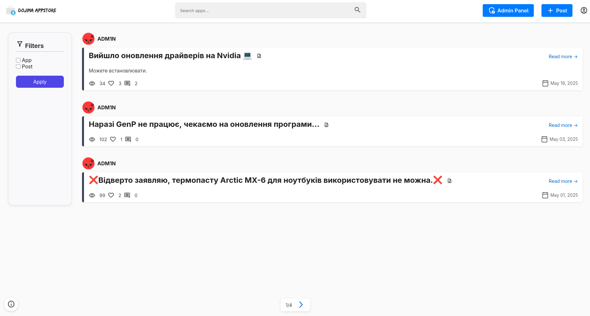
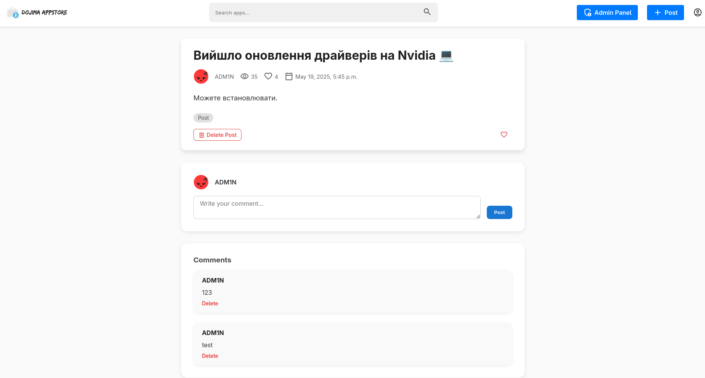
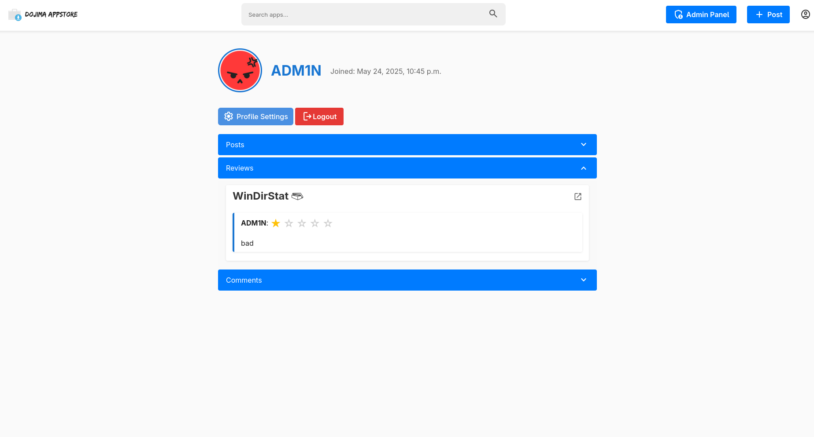

# dojima-appstore

## About

Dojima Appstore - is an App Store like open source project built on Django that focuses on providing scripts,  tools and utilities that are shared via Telegram.
It allows users to browse, filter, and download tools, provided by the community in a clean and easy-to-use interface

The Dojima Appstore project is an open source app store f

## Preview







## Building

First, create a virtual environment for the project.

```bash
python -m venv venv
```

And activate it:

```bash
#  on Windows
venv\Scripts\activate

# on macOS and Linux
source venv/bin/activate
```

Then, install all needed dependencies by running:

```bash
pip install -r requirements.txt
```

Don't forget to set up a MySQL DB server.

You're done!

Run the app with:

```bash
python appstore/manage.py runserver
```

## Debugging

Entering the MySQL shell:

```bash
mysql -u root -p
```

Reset the DB:

```bash
DROP DATABASE appstore;
CREATE DATABASE appstore;
```

## Loading data from the DB

To load the DB, it's recommended to drop the entire DB first.

```bash
mysql -u root -p
```

```bash
DROP DATABASE appstore;
CREATE DATABASE appstore;
```

Afterwards, run `makemigrations` and `migrate`:

```bash
python appstore/manage.py makemigrations
python appstore/manage.py migrate
```

Create a superuser:

```bash
python appstore/manage.py createsuperuser
```

Now, run `runserver`, wait for a second, and close the server.

This is only needed for it to create required categories and add them to the DB.

```bash
python appstore/manage.py runserver
```

Now, run the extraction script and wait for it to finish:

```bash
python appstore/tg_extract.py 
```

Now, run the script that loads the extracted data into the DB:

```bash
python appstore/tg_load_data.py tgdump/cleaned.json
```

You're done! Launch the server & mess around.
